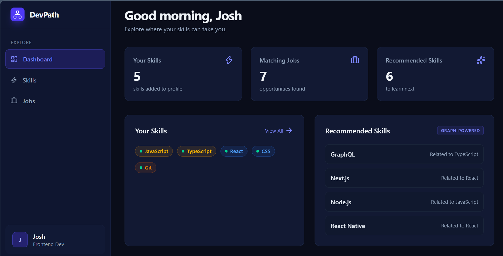
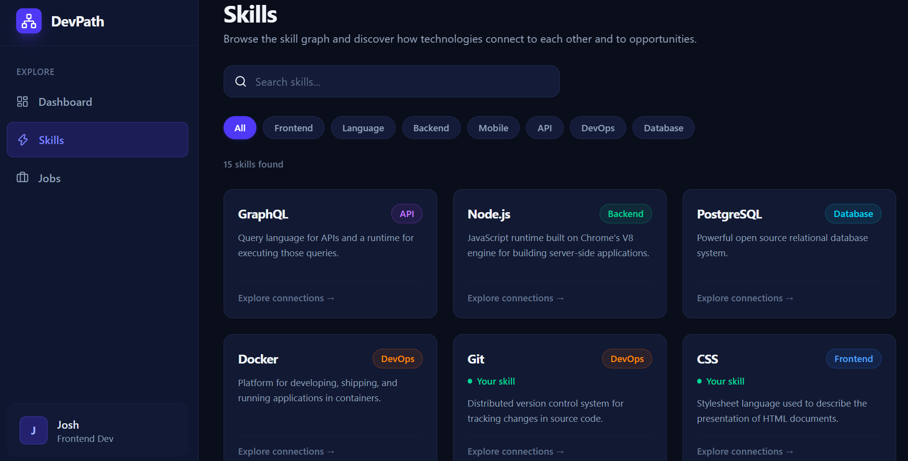
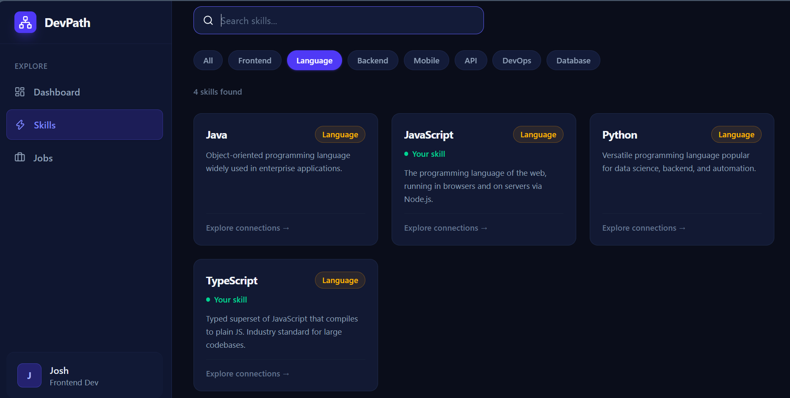
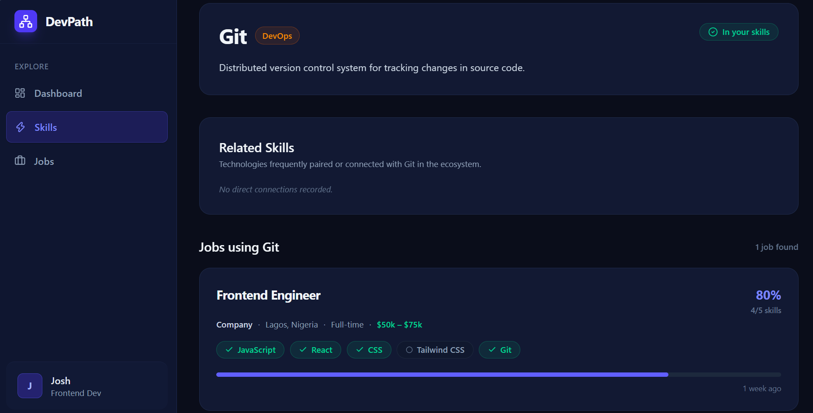
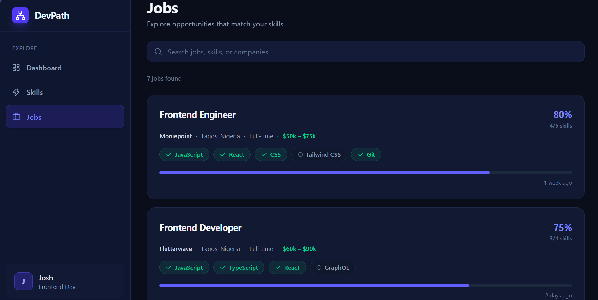

# DevPath — Graph-Powered Career & Skill Navigator

> A career pathing and job matching platform built on **CognoDB** (Graph Database), **Node.js/Express**, and **React (Vite) + Tailwind CSS**.

---

## 1. Use Case & "Why a Graph Database?"

Traditional relational (SQL) databases store career and talent data in isolated, tabular structures (`users`, `skills`, `user_skills`, `jobs`, `job_skills`, `companies`).

### The Relational Database Bottleneck
Answering real-world career questions like:
> *"Given what Josh knows today, which related technologies should he learn next that unlock the highest number of qualified job opportunities?"*

In a relational database, this requires:
- **5+ Table Joins**: Joining user skills, skill hierarchies, job prerequisites, and company profiles.
- **Recursive Subqueries & Set Differences**: Filtering out already-known skills (`WHERE NOT EXISTS`) and calculating match scores across dynamic sets.
- **Performance Overhead**: Relational join tables degrade exponentially as the dataset of developers, skills, and vacancies scales.

### The Graph Advantage (CognoDB & Cypher)
In **DevPath**, careers and technologies are naturally modeled as an **interconnected property graph**:
- **Nodes** represent real-world entities (`Person`, `Skill`, `Job`, `Company`).
- **Relationships** capture genuine domain semantics (`HAS_SKILL`, `RELATED_TO`, `REQUIRES`, `OFFERED_BY`).
- **Multi-hop Graph Traversals**: Recommendations execute in milliseconds by traversing relationship pointers across the graph with zero join-table overhead.

---

## 2. Graph Data Model

```
                    ┌──────────────┐
                    │   Company    │
                    └──────▲───────┘
                           │ OFFERED_BY
                           │
                    ┌──────┴───────┐
                    │     Job      │
                    └──────┬───────┘
                           │ REQUIRES
                           ▼
┌──────────────┐    ┌──────────────┐    RELATED_TO    ┌──────────────┐
│    Person    ├───►│    Skill     ├─────────────────►│    Skill     │
└──────────────┘    └──────────────┘ (Bidirectional)  └──────────────┘
   (Josh)      HAS_SKILL
```

### Nodes & Labels:
- `:Person` — `{ id, name, title, bio }`
- `:Skill` — `{ id, name, category, description }`
- `:Job` — `{ id, title, description, location, type, salary, postedAt }`
- `:Company` — `{ id, name, location }`

### Relationships:
- `(:Person)-[:HAS_SKILL]->(:Skill)` — Skills the developer currently possesses.
- `(:Skill)-[:RELATED_TO]-(:Skill)` — Bidirectional technology connections (e.g. React relates to TypeScript, Next.js, Redux).
- `(:Job)-[:REQUIRES]->(:Skill)` — Technical prerequisites for an open role.
- `(:Job)-[:OFFERED_BY]->(:Company)` — Company offering the role.

---

## 3. UI Screenshots & Feature Showcase

### Dashboard
*Real-time profile statistics, owned skill tags, graph-powered recommendations, and top matching jobs.*


### Skills Explorer & Category Filtering
*Interactive skill catalog with instant search, category chips, and ownership indicators.*


### Filtered Skill Graph
*Dynamic filtering by categories (e.g., Language, Frontend, Backend, DevOps).*


### Skill Details & Multi-Hop Connections
*2-hop graph traversal displaying related technologies and all jobs requiring this skill.*


### Jobs Explorer & Match Scoring
*Jobs sorted by calculated skill match percentage, with checkmarks for qualified skills and open gaps.*


---

## 4. The 5 Core Cypher Queries

### Query 1: User Profile & Owned Skills
**Endpoint:** `GET /api/profile`
```cypher
MATCH (p:Person {id: $personId})-[:HAS_SKILL]->(s:Skill)
RETURN p, collect(s) AS skills
```
*Retrieves the developer node and aggregates all verified skills in a single roundtrip.*

---

### Query 2: All Skills with User Ownership Flag
**Endpoint:** `GET /api/skills`
```cypher
MATCH (s:Skill)
OPTIONAL MATCH (p:Person {id: $personId})-[:HAS_SKILL]->(s)
RETURN s, (p IS NOT NULL) AS userHasSkill
ORDER BY s.category, s.name
```
*Uses `OPTIONAL MATCH` (graph left-join) to return all skills tagged with a boolean ownership flag.*

---

### Query 3: Skill Detail & 2-Hop Traversal (Related Skills + Matching Jobs)
**Endpoint:** `GET /api/skills/:id`
```cypher
MATCH (s:Skill {id: $skillId})
OPTIONAL MATCH (p:Person {id: $personId})-[:HAS_SKILL]->(s)
WITH s, (p IS NOT NULL) AS userHasSkill

// 1. Bidirectional Related Skills Traversal
OPTIONAL MATCH (s)-[:RELATED_TO]-(related:Skill)
OPTIONAL MATCH (p2:Person {id: $personId})-[:HAS_SKILL]->(related)
WITH s, userHasSkill, collect(DISTINCT {
  id: related.id,
  name: related.name,
  category: related.category,
  description: related.description,
  userHasSkill: (p2 IS NOT NULL)
}) AS rawRelated

// 2. Jobs Requiring this Skill
OPTIONAL MATCH (j:Job)-[:REQUIRES]->(s)
OPTIONAL MATCH (j)-[:OFFERED_BY]->(c:Company)
OPTIONAL MATCH (j)-[:REQUIRES]->(jobSkill:Skill)
OPTIONAL MATCH (p3:Person {id: $personId})-[:HAS_SKILL]->(matchedSkill:Skill)
WHERE matchedSkill = jobSkill

WITH s, userHasSkill, rawRelated, j, c,
     collect(DISTINCT {
       id: jobSkill.id,
       name: jobSkill.name,
       category: jobSkill.category,
       userHasSkill: (matchedSkill IS NOT NULL)
     }) AS jobSkills,
     count(DISTINCT jobSkill) AS totalRequired,
     count(DISTINCT matchedSkill) AS matchCount

WITH s, userHasSkill, rawRelated,
     collect(DISTINCT {
       id: j.id,
       title: j.title,
       type: j.type,
       location: j.location,
       salary: j.salary,
       postedAt: j.postedAt,
       company: c.name,
       skills: jobSkills,
       totalRequired: totalRequired,
       matchCount: matchCount,
       matchPercent: CASE WHEN totalRequired > 0 THEN round((toFloat(matchCount) / totalRequired) * 100) ELSE 0 END
     }) AS rawJobs

RETURN s, userHasSkill,
       [r IN rawRelated WHERE r.id IS NOT NULL] AS relatedSkills,
       [job IN rawJobs WHERE job.id IS NOT NULL] AS jobs
```

---

### Query 4: Jobs with Real-time Match Scoring
**Endpoint:** `GET /api/jobs`
```cypher
MATCH (j:Job)-[:REQUIRES]->(reqSkill:Skill)
MATCH (j)-[:OFFERED_BY]->(c:Company)
OPTIONAL MATCH (p:Person {id: $personId})-[:HAS_SKILL]->(matchedSkill:Skill)
WHERE matchedSkill = reqSkill

WITH j, c,
     collect(DISTINCT {
       id: reqSkill.id,
       name: reqSkill.name,
       category: reqSkill.category,
       userHasSkill: (matchedSkill IS NOT NULL)
     }) AS skills,
     count(DISTINCT reqSkill) AS totalRequired,
     count(DISTINCT matchedSkill) AS matchCount

RETURN j, c, skills, totalRequired, matchCount,
       round((toFloat(matchCount) / totalRequired) * 100) AS matchPercent
ORDER BY matchPercent DESC, j.title ASC
```
*Calculates exact qualification percentages directly inside CognoDB before returning sorted results.*

---

### Query 5: Showcase 4-Hop Traversal (Career Recommendations)
**Endpoint:** `GET /api/recommendations`
```cypher
MATCH (p:Person {id: $personId})-[:HAS_SKILL]->(known:Skill)
WITH p, collect(known) AS userSkills

UNWIND userSkills AS known
MATCH (known)-[:RELATED_TO]-(skillToLearn:Skill)
WHERE NOT skillToLearn IN userSkills

MATCH (j:Job)-[:REQUIRES]->(skillToLearn)
MATCH (j)-[:OFFERED_BY]->(c:Company)

MATCH (j)-[:REQUIRES]->(allReq:Skill)
OPTIONAL MATCH (p)-[:HAS_SKILL]->(matchedSkill:Skill)
WHERE matchedSkill = allReq

WITH j, c, skillToLearn,
     count(DISTINCT allReq) AS totalRequired,
     count(DISTINCT matchedSkill) AS matchedCount

RETURN DISTINCT j, c, skillToLearn, totalRequired, matchedCount,
       round((toFloat(matchedCount) / totalRequired) * 100) AS matchPercent
ORDER BY matchPercent DESC, j.title ASC
LIMIT 5
```
*The showpiece 4-hop career recommendation query traversing:*
`Person ──HAS_SKILL──► Known Skill ──RELATED_TO──► Skill to Learn ◄──REQUIRES── Job ──OFFERED_BY──► Company`

---

## 5. Setup & Running Locally

### Prerequisites
- Node.js (v18+)
- Active [CognoDB](https://cognodb.io) or Neo4j instance

### 1. Clone the repository
```bash
git clone https://github.com/Joshua-Ochiba/CognoDB-Assignment-2-Joshua-Ochiba.git
cd CognoDB-Assignment-2-Joshua-Ochiba
```

### 2. Configure Backend Environment
Inside `server/.env`:
```env
PORT=3001
COGNODB_URI=bolt://your-cognodb-instance:7687
COGNODB_PASSWORD=your-secure-password
```

### 3. Install & Seed Database
```bash
# In server directory
cd server
npm install
node scripts/seed.js   # Seeds nodes, relationships, and demo developer profile
node index.js          # Starts backend on http://localhost:3001
```

### 4. Start React Frontend
```bash
# In client directory (open a new terminal)
cd ../client
npm install
npm run dev            # Starts Vite dev server on http://localhost:5173
```

---

## 6. Live Demo & Video Walkthrough

- **Live Application Demo:** [https://cogno-db-assignment-2-joshua-ochiba.vercel.app/](https://cogno-db-assignment-2-joshua-ochiba.vercel.app/)
- **Live API Endpoint:** [https://cognodb-assignment-2-joshua-ochiba.onrender.com/](https://cognodb-assignment-2-joshua-ochiba.onrender.com/)
- **Video Walkthrough:** [https://drive.google.com/file/d/1S_Vdzva9tKSKsLeQVklQho1sHg_Sc7C9/view?usp=sharing] 

---

## 7. Project Architecture

```
DevPath/
├── deliverables/               # Screenshots & demonstration assets
│   └── ui-screenshots/
├── client/                     # React (Vite) Frontend
│   ├── src/
│   │   ├── api/index.js        # Centralized data fetching layer
│   │   ├── components/         # Reusable UI components (Sidebar, JobCard, SkillTag, StatCard, States)
│   │   ├── pages/              # Views (Dashboard, Skills, SkillDetail, Jobs, JobDetail)
│   │   ├── App.jsx             # React Router configuration
│   │   └── index.css           # Tailwind design tokens & dark theme
│   └── vite.config.js          # API proxy configuration
├── server/                     # Express Backend
│   ├── db/driver.js            # CognoDB connection pool singleton
│   ├── routes/                 # Parameterised Cypher API routes (profile, skills, jobs, recommendations)
│   ├── scripts/seed.js         # Realistic graph dataset population script
│   └── index.js                # Express entrypoint & CORS middleware
└── README.md
```
